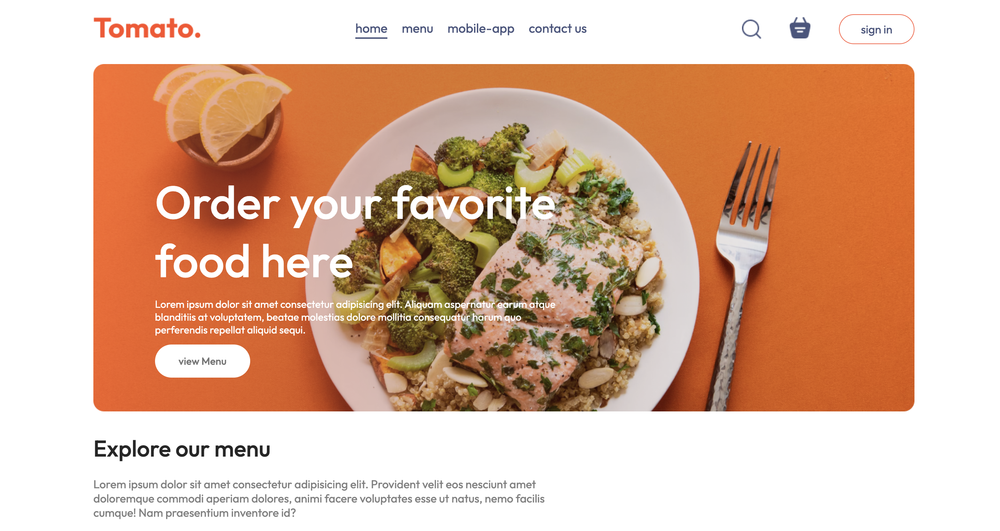
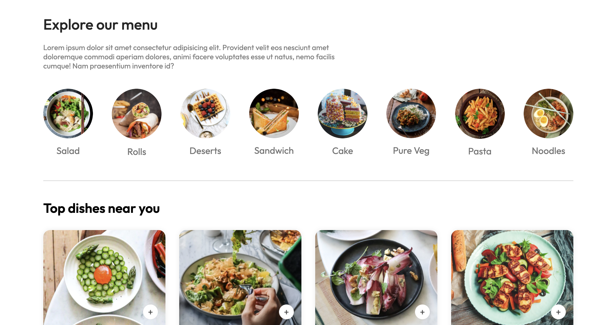
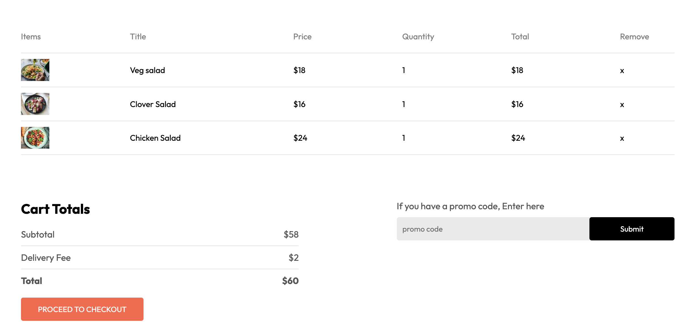
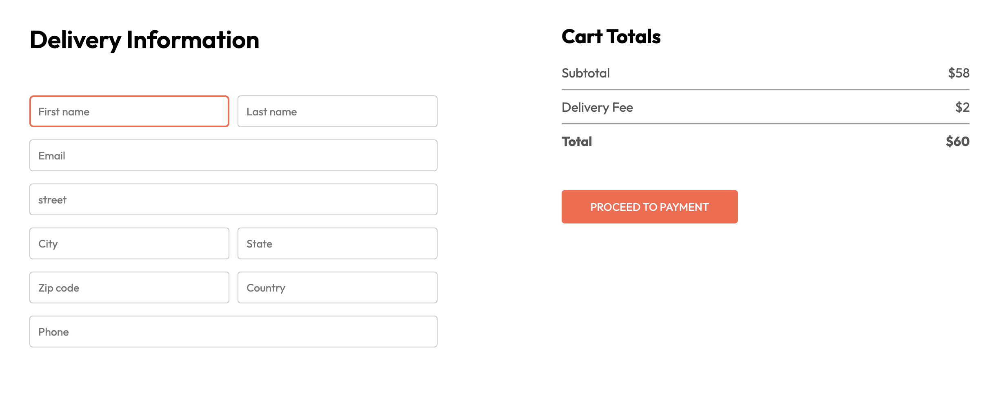
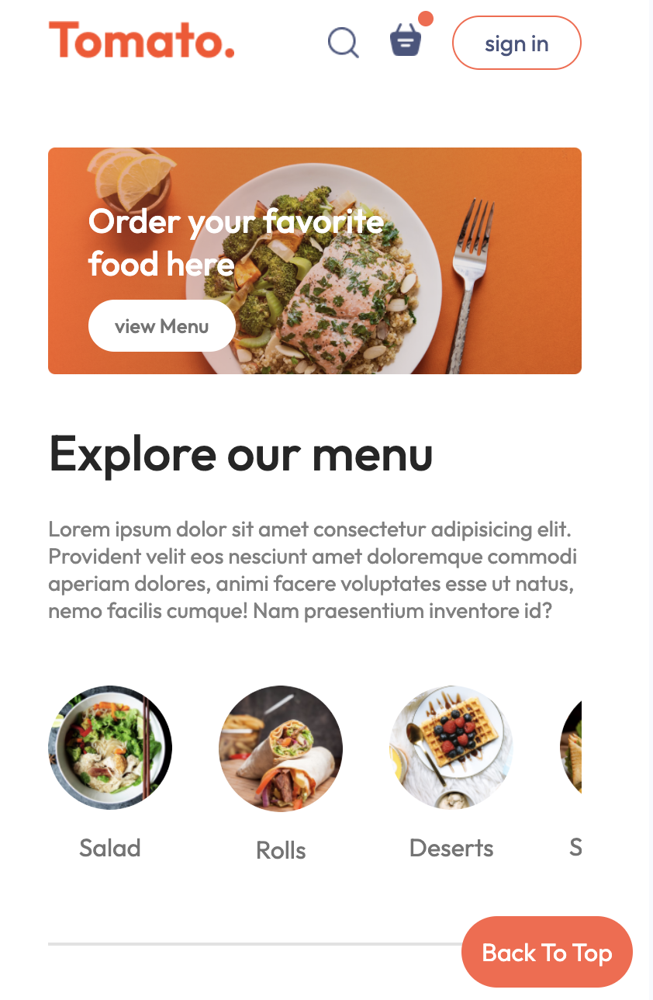

# My Webstack - Portfolio Project

## Foody-Website-Project

## Introduction

This Project is about building a food ordering website that's super easy to use.

- Deployed Site: (https://graceful-babka-431732.netlify.app/)

### Authors

- [Sara Chafik idrissi](https://www.linkedin.com/in/sara-chafik-idrissi/)


## Usage
### Installation

To run Foody locally, follow these steps:

1. Clone the repository:

   ```bash
   git clone https://github.com/sarachafikidrissi/Foody-Website-Project.git

2. Navigate to the project directory:
    ```bash
    cd foody


### Getting Started
1. Run the application:
    ```bash
    npm start
2. Open your web browser and go to http://localhost:5000 to access the application.


## Contributing

We welcome contributions to Foody Webstack - Portfolio Project . To contribute, follow these steps:

1. Fork the repository.
2. Create a new branch (git checkout -b feature/improvement).
3. Make your changes.
4. Commit your changes (git commit -am 'Add new feature').
5. Push to the branch (git push origin feature/improvement).
6. Create a new Pull Request.

## Related Projects


## Licensing

This project is licensed under the MIT License - see the LICENSE.md file for details.

## Screenshots







## Resources

- []()

